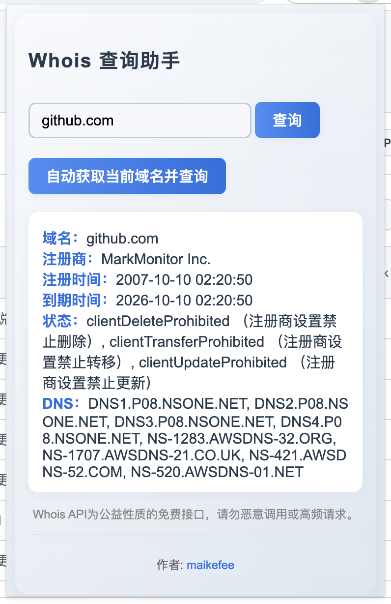

# Whois 查询助手

一个简单易用的 Chrome 扩展，用于查询域名的 Whois 信息。

## 功能特性

- 🔍 手动输入域名查询 Whois 信息
- 🚀 自动获取当前网页域名并查询
- 📱 简洁美观的弹窗界面
- 🌐 支持中文界面

## 安装方法

1. 下载或克隆此项目到本地
2. 打开 Chrome 浏览器，进入扩展程序管理页面 (`chrome://extensions/`)
3. 开启"开发者模式"
4. 点击"加载已解压的扩展程序"
5. 选择项目文件夹

## 使用方法

1. 点击浏览器工具栏中的扩展图标
2. 在弹窗中输入要查询的域名，或点击"自动获取当前域名并查询"
3. 查看 Whois 查询结果

## 注意事项

- Whois API 为公益性质的免费接口，请勿恶意调用或高频请求
- 部分域名可能因为隐私保护而无法查询到详细信息

## 作者

**maikefee**
- GitHub: [@Maikefee](https://github.com/Maikefee)

## 许可证

MIT License